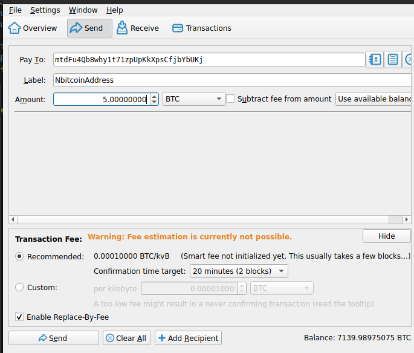
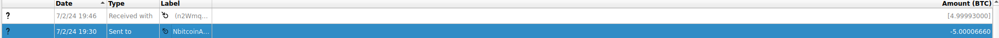

### Sending to a Legacy Address from NBitcoin

This is more of a curiosity than anything. I have been dotnet developer for a few years and love C#. I've actually looked at the library for interacting with the Bitcoin network before but never really did anything with it. So this will likely be part one of a series on working with it. I have use `bitcoinjs` n the past but find that `NBitcoin` is more supported at least as far as more recent commits and is what is used in BTCPay Server. At this point I will be using `Regtest` and likely move to using some `TestNet` coins that I have.

### Getting Setup?

Send some amount of coins to a legacy address that I have created. This can be done using `NBitcoin` like so:

```csharp
Network network = Network.RegTest;
Key bitcoinPrivateKey = new Key().GetBitcoinSecret(network);
var legacyAddress = bitcoinPrivateKey.PubKey.GetAddress(ScriptPubKeyType.Legacy, network);
Console.WriteLine(legacyAddress); //mtdFu4Qb8why1t71zpUpKkXpsCfjbYbUKj
BitcoinSecret bitcoinSecret = bitcoinPrivateKey.GetWif(Network.RegTest);
Console.WriteLine(bitcoinSecret); // cU6GUowDkCVQPhy3dsD6RwkoyBeHk41rYMYExhs5VZH8URabKFyv make sure to save this you'll need it later...

```

In my instance this led an address like so `mtdFu4Qb8why1t71zpUpKkXpsCfjbYbUKj` and I simply sent some regtest coins to it.


Get the transaction Id and in your console/cli get the hex value for the transaction. Save that in the `var transaction = Transaction.Parse("0200000004...", network);` as we will parse that to get our outputs for the new inputs to send again to our other address.

```

19:34:18

getrawtransaction 7243d2760388821371b39ef98212d24c7d43d3541790294213b407bf9ffdf3ab


19:34:18

0200000004691fb673618c27b26b5c29af44893612b6213eb3bcf4d020a24058800bc09155000000006a47304402204149b65f37ee231c113311165201e77abec713c23aa28368a356385b8bb54224022059668e87ec6598651bb5476772e4aa90a7d128bf2dd6599c677517f66407f58a0121037ab2eea8c43f8aa0f7311c86878eb286feeb862f37f69f24c6d2e85bd3a2f7cdfdffffffda0103a8a13cbe8cee2d2896502338a13d95d9a60a32e26ab76b8e57b781c975040000006a47304402202b2786d6fb640d6215d9227650d11fc4c5aa1836eaaae5ddc89120e990cc598b02203a0a7ebf91139f1dc878192b021d005561bd57cf743bf4220be589ee6cc7b3ad0121020055836de77cc0836ea3d713879929dd4ed4e619b92b607111c6de23c3553a73fdffffffde0b046be5df79fa5a3254e96cc612e71edacc1e5d2dcc7c3241c188c4ad4508020000006a473044022021513ef732fbeb3bae9244497532e62745f337a1aab765adb33117195c984370022014e4cc67e2bd12dbe6e49128f5f99dd542ce3d24b68ea5a1ff5f10d1dcc6f80c012103556bb5a184b64757b70e54c6f067420709971ab4178aebffa338bf6a1db2e3abfdffffffda0103a8a13cbe8cee2d2896502338a13d95d9a60a32e26ab76b8e57b781c975030000006a47304402201679e0645452dc965afd74036ba1ce39617ef4327376112c3f2f893c1559fe9302204e0bc5e661ccb730debae2dea4491c263e9e53e442ae25ce3592d8ac6a6e536c012103556bb5a184b64757b70e54c6f067420709971ab4178aebffa338bf6a1db2e3abfdffffff020065cd1d000000001976a9148fcad35e53b5f787726ebd4a508687dc4729384888ac169e310a010000001976a914bed91c0f45f8796c3333dbaa62de5ce53ea2341988acf3000000

```


### Complete Code Sample

If you have gotten this far you should be able to paste in your saved WIF secret (Wallet Import Format) and another address to send coins to. I did this using Bitcoin Core, but you could do the same as above. Something else to note, is that the miner fee is purely an excercise here. I imagine that in most situations you would want to do this with better estimation, and same with the coins. I am simply parsing the transaction hex for the prior address I know I have coins in to spend from again. Also, this does not take into account change back. Like I said I was mostly doing this for my own edification. But anyways, hope someone finds it helpful. 


```csharp
using NBitcoin;
using NBitcoin.Protocol;

public class LegacyPayToAddress
{
    public static void Run()
    {
        //We will send the coins from this address mtdFu4Qb8why1t71zpUpKkXpsCfjbYbUKj to the one below and has the available output from 
        //the transaction with the hash 597ca9461b98b541f4d63e4679381947df7698c26750b1ad611bf08e947be2ac
        Network network = Network.RegTest;
        //Key bitcoinPrivateKey = new Key();
        //var legacyAddress = bitcoinPrivateKey.PubKey.GetAddress(ScriptPubKeyType.Legacy, network); 
        //Console.WriteLine(legacyAddress); //mtdFu4Qb8why1t71zpUpKkXpsCfjbYbUKj
        //BitcoinSecret bitcoinSecret = bitcoinPrivateKey.GetWif(Network.RegTest); 
        // Console.WriteLine(bitcoinSecret); // cU6GUowDkCVQPhy3dsD6RwkoyBeHk41rYMYExhs5VZH8URabKFyv
        var bitcoinSecret = new BitcoinSecret("cU6GUowDkCVQPhy3dsD6RwkoyBeHk41rYMYExhs5VZH8URabKFyv", network);
        var addressToSendTo = new BitcoinPubKeyAddress("n2WmqedHyr8j6kTh6VCZ4Yu3gwoCRmH8jo", network);
        var transaction = Transaction.Parse("0200000004691fb673...,network);

        Coin coin = new Coin();
        Money totalToSend = new Money(0, MoneyUnit.BTC);

        TxOutList outputs = transaction.Outputs;

        foreach (TxOut output in outputs)
        {
            var paymentScript = output.ScriptPubKey;
            var address1 = paymentScript.GetDestinationAddress(network);
            if(address1 == bitcoinSecret.PubKey.GetAddress(ScriptPubKeyType.Legacy, network)) //Check if the address is the same as the one we have the private key for (a bit naive, but it works for this example)
            {
                Console.WriteLine("This is your money");
                var minerFee = new Money(0.00007m, MoneyUnit.BTC); //Need to set a fee to get it mined by the network
                coin = new Coin(transaction,output);
                var outputValue = new Money(output.Value, MoneyUnit.Satoshi);
                totalToSend = outputValue - minerFee; //We will send all the money, minus the fee
        
            }
        }
        using (var node = Node.ConnectToLocal(network)) //Connect to the node
        {
            var transactionToSend = Transaction.Create(network);
            transactionToSend.Inputs.Add(new TxIn()
            {
                PrevOut = coin.Outpoint, ScriptSig = bitcoinSecret.PubKey.ScriptPubKey
                
            });

            transactionToSend.Outputs.Add(totalToSend, addressToSendTo.ScriptPubKey);

            node.VersionHandshake();

            transactionToSend.Sign(bitcoinSecret, coin);
            node.SendMessage(new InvPayload(InventoryType.MSG_TX, transactionToSend.GetHash()));
            node.SendMessage(new TxPayload(transactionToSend));
            Thread.Sleep(500);

        }
    }
}
```

Note also that I am using the node here and not sure exactly how that is working as I am only using Regtest and not sure if is interacting with the node as a peer? Or if it's some RPC methods being called. I need to find out more. 

### If All Goes Well

You should see another transaction and your coins, minus the fee have moved to that other address. And will be spendable again as a new UTXO (unspent transaction output). 
